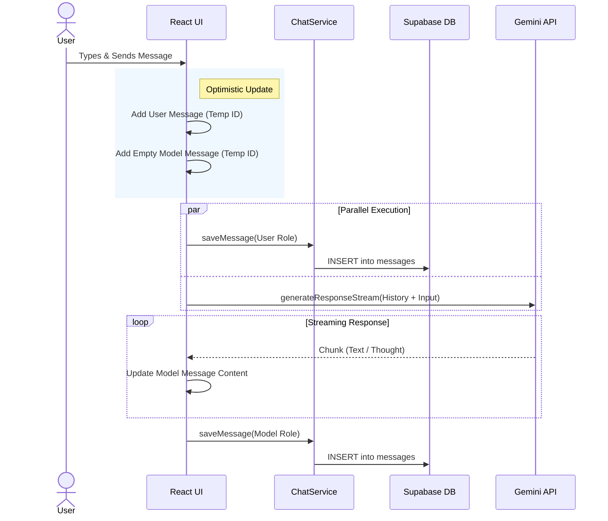
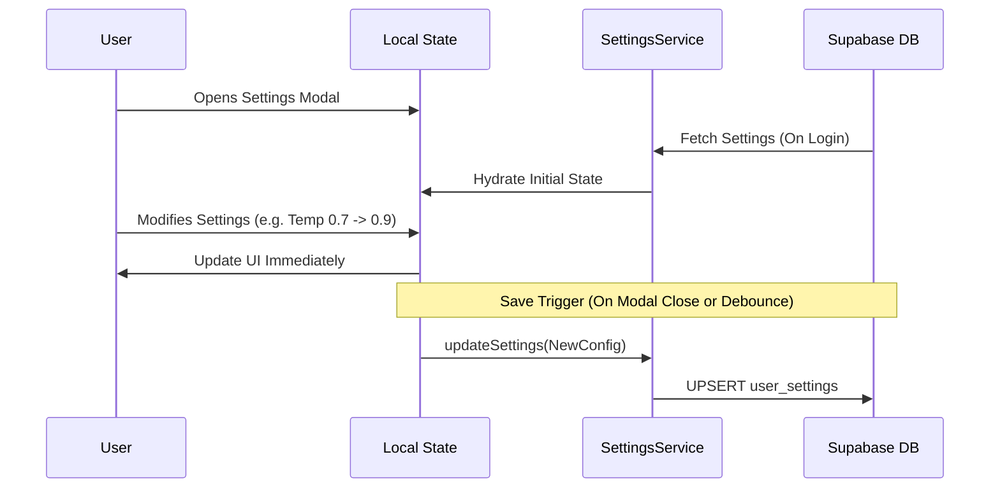
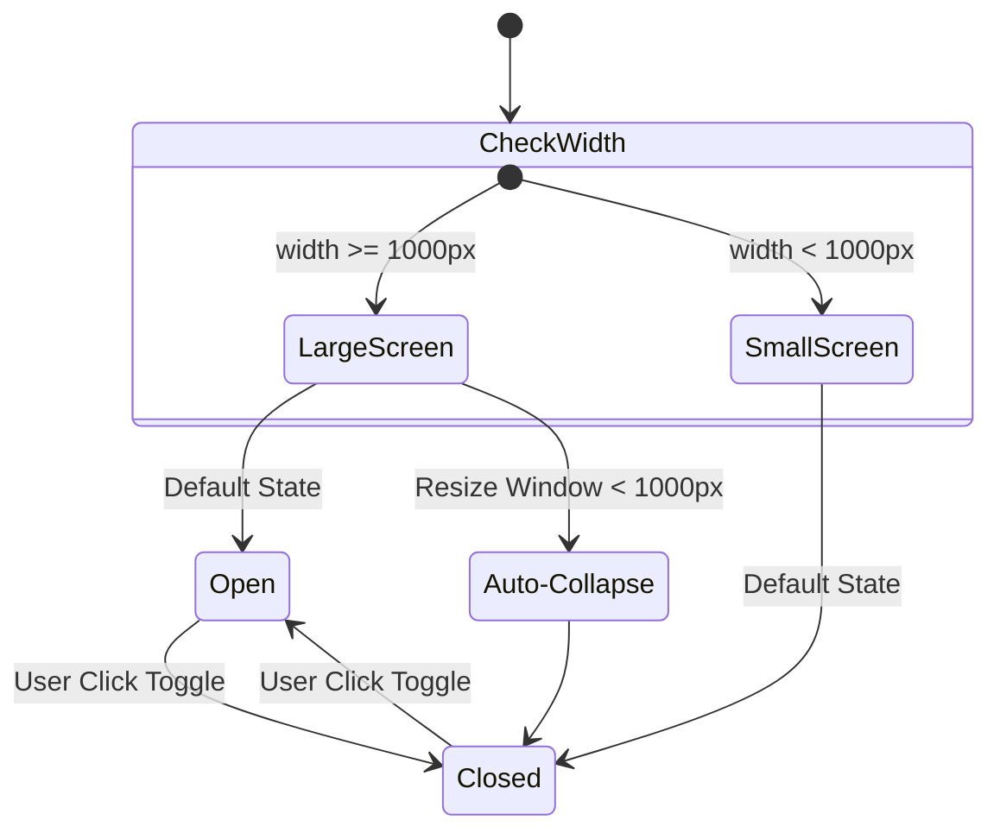

# 🔄 Program Flows & Architecture Diagrams

This document outlines the core logical flows of the Gemini Chat Clone using detailed explanations and Mermaid.js diagrams to visualize the processes.

---

## 1. Authentication Flow

This flow manages user identity, session restoration, and route protection.

```mermaid
graph TD
    A[App Mounts] --> B{Check Local Session}
    B -- Found -- > C[Verify with Supabase]
    B -- Not Found --> D[Guest/Public Mode]
    
    C -- Valid --> E[Set User Context]
    C -- Invalid --> D
    
    E --> F[Enable Persistence Features]
    D --> G[Disable Persistence Features]
    
    subgraph Login Process
    H[User Clicks user Login] --> I[Supabase OAuth/Email]
    I --> J{Success?}
    J -- Yes --> E
    J -- No --> K[Show Error]
    end
```

### Detailed Logic
- **Initialization**: `AuthContext` checks `supabase.auth.getSession()` on mount.
- **State**: The `useAuth` hook exposes `user`, `session`, and `loading`.
- **Guest Mode**: If no user is logged in, the app operates in "Guest Mode" where chats are stored only in local React state and lost on refresh.

---

## 2. Chat Persistence & Streaming Execution

This is the core loop of the application: sending a message, saving it, and streaming the response.



### Detailed Logic
1.  **Optimistic UI**: The UI updates immediately to feel responsive.
2.  **Dual Persistence**: 
    - The **User's message** is saved to Supabase immediately.
    - The **AI's response** is saved *after* the stream completes to store the full coherent text.
3.  **Error Handling**: If Supabase fails, the user is notified, but the chat might continue locally. If Gemini fails, a specific error message node is created.

---

## 3. Gemini API Integration Strategy (Thinking Mode)

How the application handles standard generation vs. the new "Thinking Mode" in Gemini 3 Flash.

```mermaid
flowchart LR
    Start[User Input] --> Prep[Prepare Payload]
    
    subgraph Context Construction
    Prep --> Hist[Filter History]
    Prep --> Attach[Base64 Attachments]
    Prep --> Sys[Inject System Prompts]
    end
    
    Context Construction --> Config{Model Selection}
    
    Config -- Gemini 3 Pro --> Stream[Standard Stream]
    Config -- Gemini 3 Flash --> ThinkCheck{Thinking Enabled?}
    
    ThinkCheck -- Yes --> ThinkConfig[Set thinking_config='high']
    ThinkCheck -- No --> Stream
    
    ThinkConfig --> Stream
    
    subgraph Streaming Loop
    Stream --> Parse{Parse Chunk}
    Parse -- Text --> AppendText[Append to UI]
    Parse -- Thought --> WrapTag[Wrap in <thinking> Logic]
    WrapTag --> AppendText
    end
    
    AppendText --> Done[Stream Complete]
```

### Key Components
- **Payload Preparation**: Converts internal message objects into Google's `Content` format.
- **Thinking Parser**: The `geminiService` listens for `thought` fields in the chunk candidates. If found, it wraps them strictly in `<thinking>` tags so the frontend `markdown` component knows to render them as collapsible "Reasoning" blocks.

---

## 4. Settings Synchronization Flow

Ensures user preferences (Temperature, Safety, System Instructions) are consistent across devices.



## 5. Responsive Sidebar Logic

Manages mobile vs. desktop navigation states.



### Logic
- **Initialization**: The default state (`isOpen`) is calculated strictly on the initial mount based on `window.innerWidth`.
- **Event Listeners**: A resize listener updates the state *only* when crossing the 1000px threshold to avoid layout thrashing during minor resizes.
